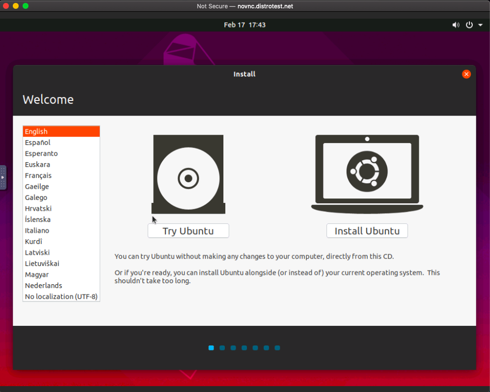
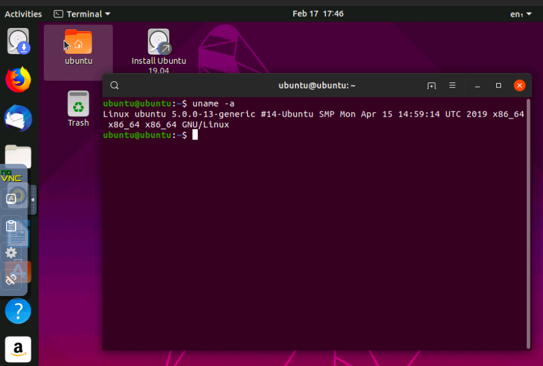
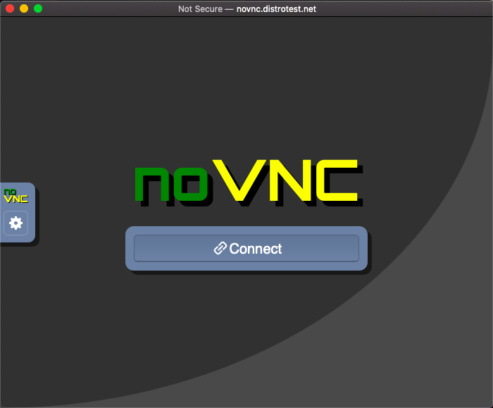

# Lab 1 Exploring Linux Distributions
---
## Requirements:
* **You will use Github to submit this Lab. Watch the 'What is Git and Github?' video before your start**
* Create a Github account before your start this lab.
* Bold your answers *(2 points)*
* Format your screenshots accordingly (not too big, not too small). If I can’t read it, I cannot grade it.
* Video: https://youtu.be/8Sa52S527Qc

## Working with Distrowatch
---
### Question 1
During class, we explored the concept of Linux distribution. During this lab, you will research some Linux distributions using a website called Distrowatch. DistroWatch is a website that provides news, popularity rankings, and other general information about various Linux distributions and other Unix-like operating systems such as OpenSolaris, MINIX and BSD. 

Go to [Distrowatch](https://distrowatch.com/). Explore the website to get familiar with the home page. On the top left corner, you have a form that allows you to submit queries to the website. In the **“Type Distribution Name”** box type **“Ubuntu”.**  This will return details about Ubuntu. Explore the Ubuntu Distrowatch page and answer the following questions:

1. What is the OS Type: 
    * **Linux** 

2. Which major distro is it based on?  
   * **Debian**
   
3. Which processor architecture does it support?  
   * **armhf, i686, powerpc , ppc64el , s390x, x86_64**

4. Is the distribution active or is it discontinued?  
   * **active**

5. What is the distro’s home page?  
   * **https://www.ubuntu.com/**

### Question 2
On the top left corner, click on “Random Distribution” and answer the following questions from the distro you got.
1. What is the name of the distribution and the OS Type: 
   * **The name of of the distribution is Linux Mint and the OS type is Linux**

2. Which major distro is it based on?  
   * **Debian, Ubuntu (LTS)**
   
3. Which processor architecture does it support?  
   * **i686, x86_64**

4. Is the distribution active or is it discontinued?  
   * **Active**

5. What is the distro’s home page?  
   * **https://linuxmint.com/**

### Question 3
On the top of the page, right in the middle, you will find an option that allows you to search for distributions. 
Click on **“Search”** and after the page loads, fill in the following information in the **“Search Distribution by Criteria”** section and Click on Submit Query.
* OS Type: Linux
* Architecture: x86_64
* Status: Active
* Leave the rest as default.

From the query results, choose any distribution and answer the following question about the distro you chose.

1. What is the name of the distribution? 
   * **Pop!_OS**
  
2. What is the country of Origin?
   * **USA**
  
3. What major distribution is it based on?
   * **GNOME**

4. What is the distribution category?
   * **Desktop, Live Medium**
  
5. Which processor architecture, aside from the one in the original query, does the OS support?
   * **none only x86_64**

### Question 4
Now that you know how to use Distrowatch. Find a Linux distribution for the following scenarios. For each distribution provide the website, name, and supported architecture.

1. A Linux distribution used for Data Rescue/Data recovery
* Distro Name: **Redo Rescue**
* Website: **http://redorescue.com/**
* Desktop Environment: **LXDE**

1. A Linux distribution used for Education that supports the ix86 processor architecture.
* Distro Name: **Guix System**
* Website: **https://www.gnu.org/software/guix/**
* Desktop Environment: **Enlightenment, GNOME, LXDE, MATE, Xfce**

3. A Linux distribution that supports the OEM installation method
* Distro Name: **Ubuntu MATE**
* Website: **https://ubuntu-mate.org/**
* Desktop Environment: **MATE**

### Question 5 (Extra credit 2 pts - Optional)
On the Distrowatch homepage in the menu located in the middle of the page, you will find an option called **“Submit Distribution”.** This option lists all the Linux distros that are pending evaluation, on development or that are experiencing some sort of legal constraint.  Select one of these distributions and in a paragraph, share your thoughts. (keep it simple 5 to 8 sentences).

**I came across a distribution named UNRAID. UNRAID is labeled under locale, language or trademark concerns. The server allows data users have flexibility,scalability  and modularity with the applications in the device. I think this is a great software that should be cleared due to the fact that we can control our data. It will provide users with a relief of security. Gamers can take this to their advantage and can build their own softwares. This software can be beneficial to all types of users software,AR/VR designers and graphic designers.**

## Working with DistroTest.net
### Question 6
DistroTest.net is a project that allows you to test Linux/BSD distributions on your web browser. This website is great for trying out distributions before you even download the ISO file. Go to [Distrotest.net](https://distrotest.net/) and click on any of the distributions. Start the distribution and take a screenshot of the browser window that just popped up.

 

Locate the terminal application in the distribution you started and type the following command: `uname -a` Take a screenshot of the browser window showing the terminal application open.

Stop the machine and take a screenshot of the browser window showing that the machine has been stopped.

