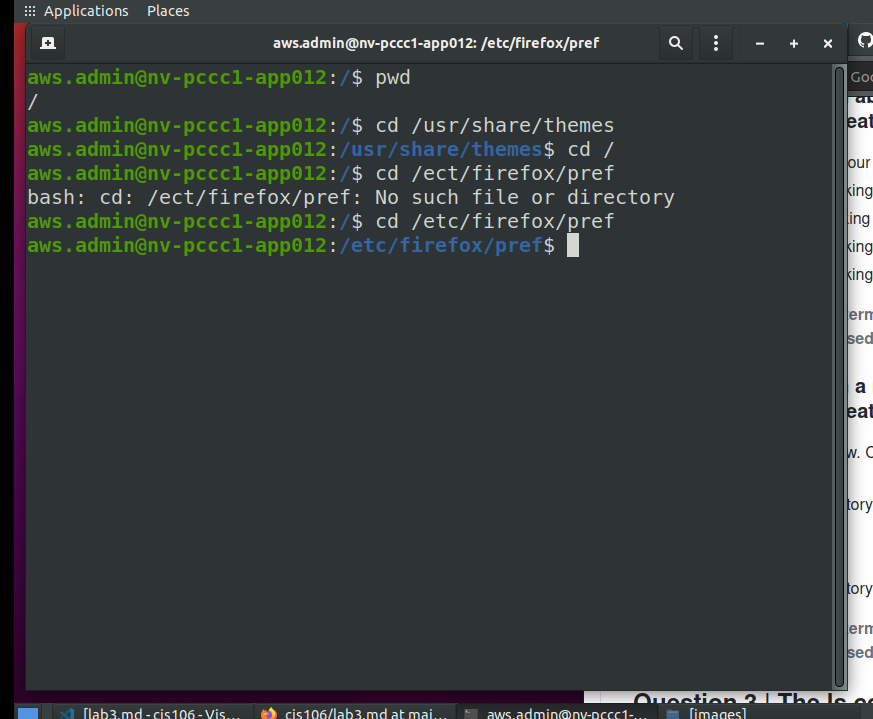
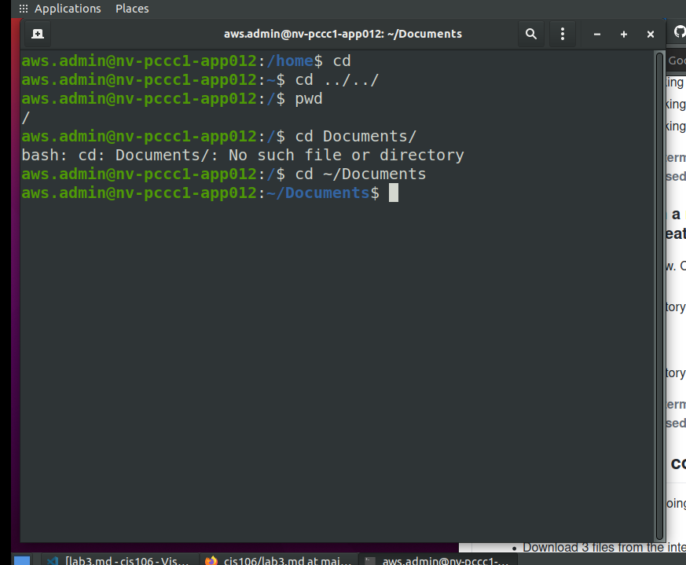
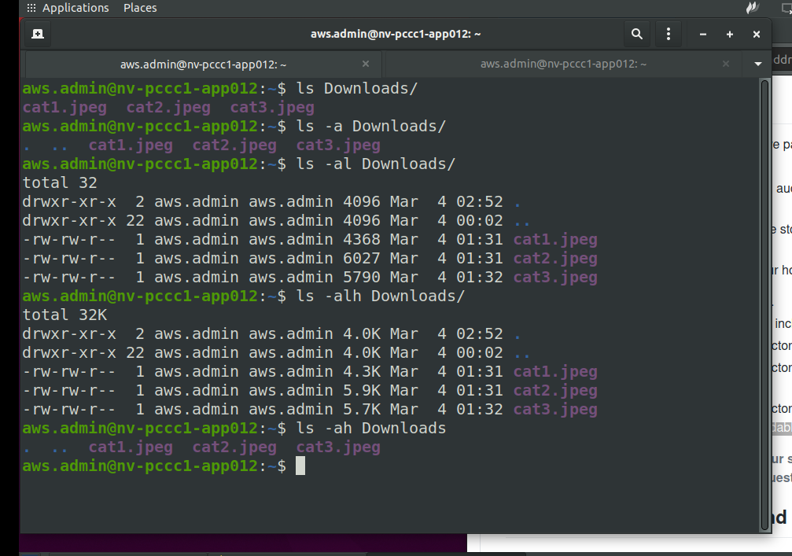
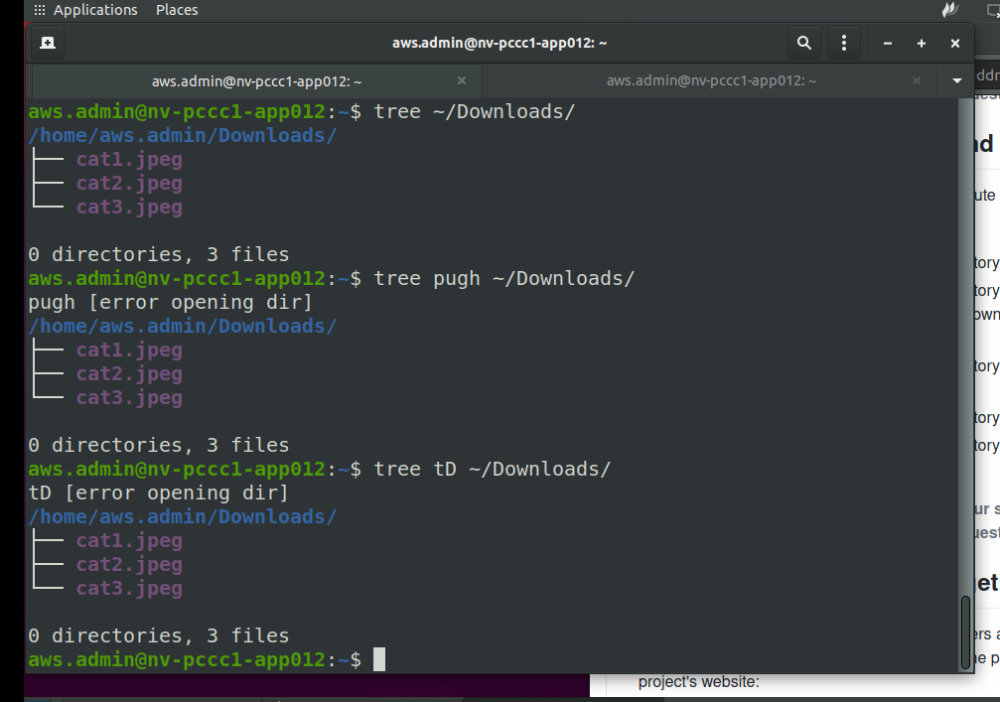
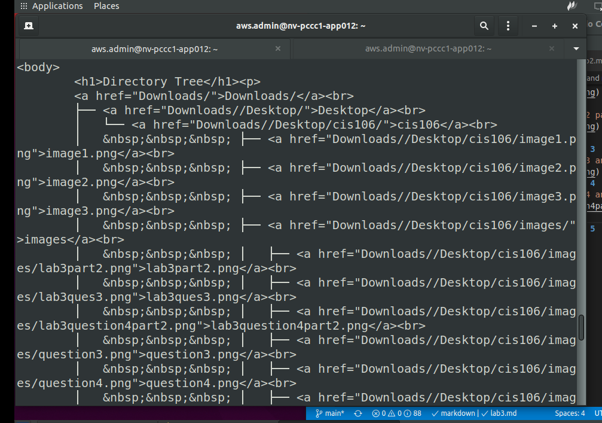
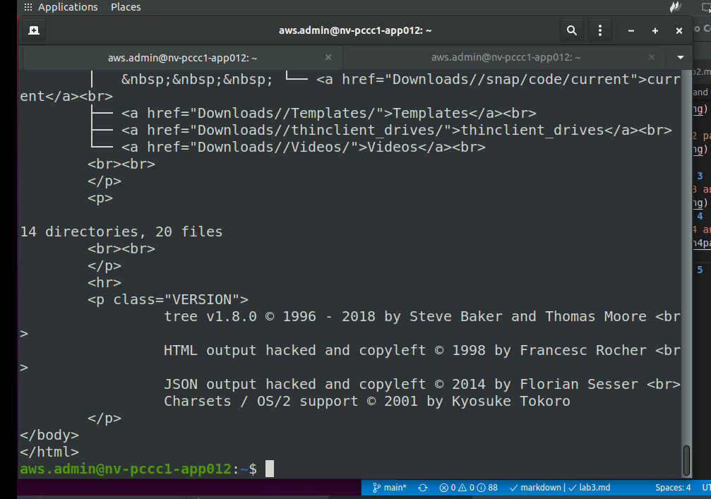
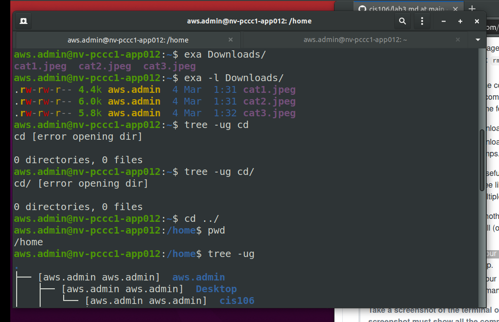

# Lab 3 | Installing software and navigating the file system | Answers
Assignment description [here](https://raw.githubusercontent.com/ra559/cis106/main/labs/lab3.md)

## Question 1
1. Which command did you use to search for the themes and to install them?
   - apt search theme,  sudo apt install
2. Which commands did you use to find and install the web browser?
   - apt search web browser, sudo apt install 
3.1 What is the name of the package?
   - Surfraw
3.2 What dependencies are needed in order to install the package? (you can either take a screenshot of the terminal or copy and paste from the terminal)
   - The following additional packages will be installed:
  libalgorithm-c3-perl libb-hooks-endofscope-perl
  libb-hooks-op-check-perl libboolean-perl libcache-perl
  libcgi-fast-perl libcgi-pm-perl libclass-accessor-chained-perl
  libclass-accessor-perl libclass-c3-perl libclass-c3-xs-perl
  libclass-data-inheritable-perl libclass-errorhandler-perl
  libclass-inspector-perl libclass-method-modifiers-perl
  libclass-singleton-perl libclass-xsaccessor-perl libclone-perl
  libdata-optlist-perl libdata-page-perl
  libdatetime-format-builder-perl
  libdatetime-format-flexible-perl
  libdatetime-format-iso8601-perl libdatetime-format-mail-perl
  libdatetime-format-natural-perl
  libdatetime-format-strptime-perl libdatetime-format-w3cdtf-perl
  libdatetime-locale-perl libdatetime-perl
  libdatetime-timezone-perl libdevel-callchecker-perl
  libdevel-caller-perl libdevel-lexalias-perl
  libdevel-stacktrace-perl libdynaloader-functions-perl
  libeval-closure-perl libexception-class-perl
  libexporter-tiny-perl libfcgi-perl libfeed-find-perl
  libfile-nfslock-perl libfile-sharedir-perl libheap-perl
  libio-string-perl liblist-moreutils-perl
  liblwp-authen-wsse-perl liblz1 libmodule-implementation-perl
  libmodule-pluggable-perl libmodule-runtime-perl
  libmro-compat-perl libnamespace-autoclean-perl
  libnamespace-clean-perl libpackage-stash-perl
  libpackage-stash-xs-perl libpadwalker-perl
  libparams-classify-perl libparams-util-perl
  libparams-validate-perl libparams-validationcompiler-perl
  libreadonly-perl libref-util-perl libref-util-xs-perl
  librole-tiny-perl libspecio-perl libsub-exporter-perl
  libsub-exporter-progressive-perl libsub-identify-perl
  libsub-install-perl libsub-name-perl libsub-quote-perl
  liburi-fetch-perl liburi-template-perl libvariable-magic-perl
  libwww-opensearch-perl libxml-atom-perl libxml-feed-perl
  libxml-libxml-perl libxml-libxslt-perl
  libxml-namespacesupport-perl libxml-rss-perl
  libxml-sax-base-perl libxml-sax-expat-perl libxml-sax-perl
  libxml-xpath-perl libxstring-perl links surfraw-extra

3.3 How much disk space will the package utilize after installation?
  - 5,817 kB

## Question 2

## Question 3

## Question 4

## Question 5

