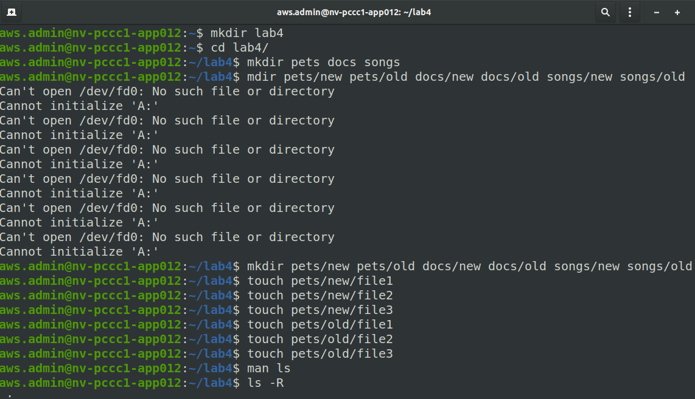
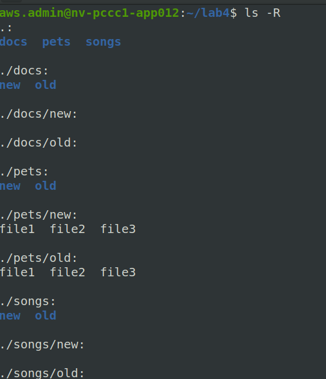
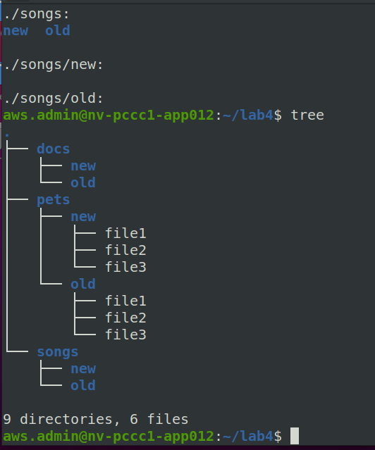
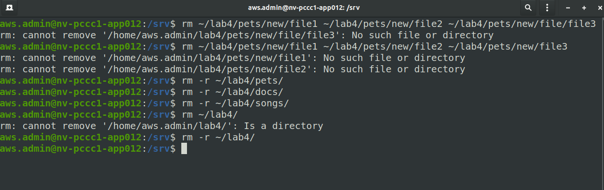
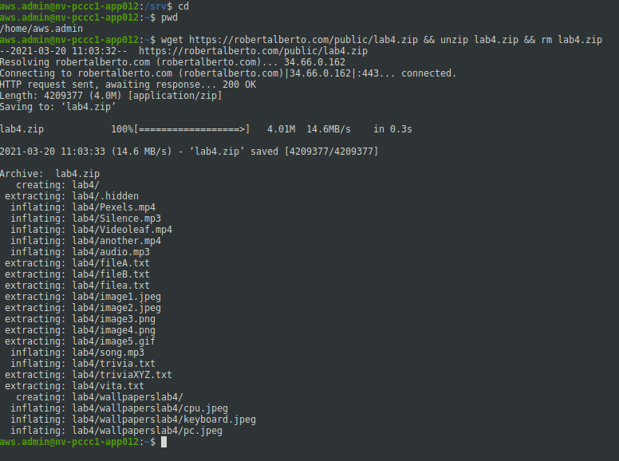
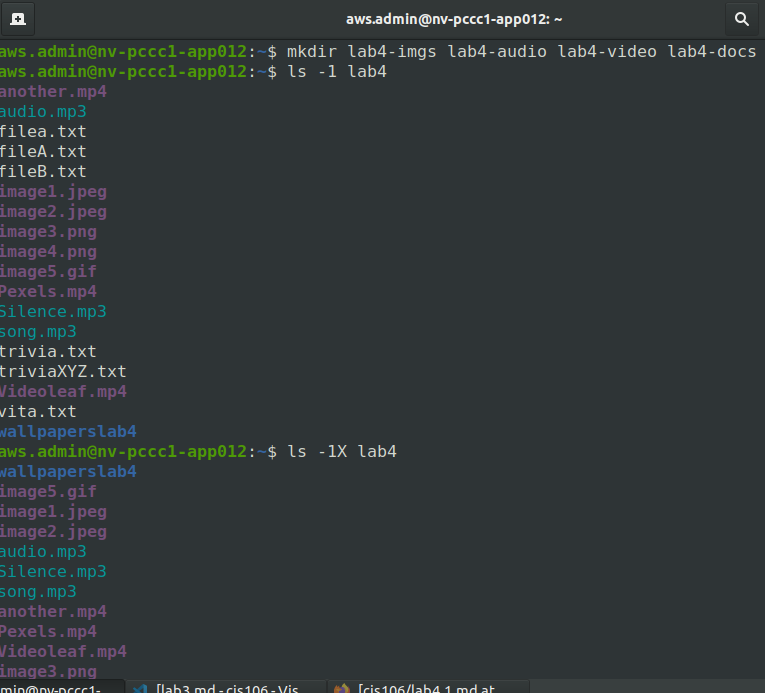
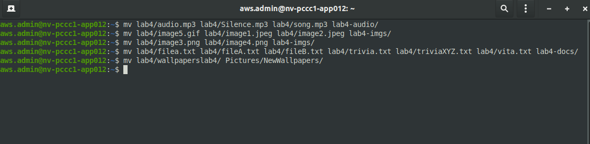
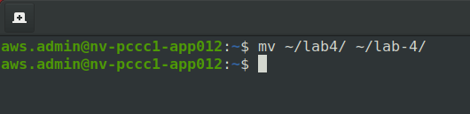
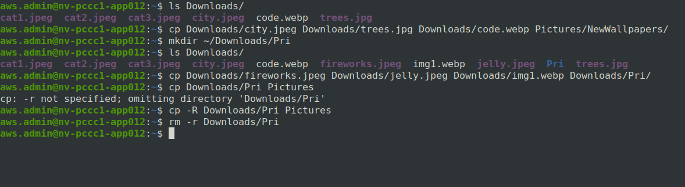

Question 1: Creating Files and Directories

    Create a Directory in YOUR home directory labeled: lab4. Change your current working directory to ~/lab4.
    Create 3 directories: pets,docs,songs. Inside each directory, create 2 subdirectories called: new and old.
    Inside the new and old directories, create 3 files: file1, file2, and file3.
    list the lab4 directory recursively.
    Use the tree command to list the lab4 directory.

    

Question 2: Removing Files and Directories

    Change your current working directory to: /srv/
    Remove the file1, file2, file3 files inside the labs/pets/new/ directory without changing your current working directory.
    Remove the pets directory without changing your current working directory.
    Remove the docs and songs directories without changing your current working directory.
    Remove the lab4 directory without changing your current working directory.

# Question 2 answer

Question 3: Moving Files and Directories

    Make sure that you are working on your home directory. Run the following command: wget https://robertalberto.com/public/lab4.zip && unzip lab4.zip && rm lab4.zip
    In your home directory, create the following directories: lab4-imgs, lab4-audio, lab4-video, lab4-docs
    Move all the files inside the lab4 directory to their respective new directories in your home directory.
    Inside the lab4 directory, you will find a directory called Wallpaperlab4. Move this directory to your Pictures directory and rename it to NewWallpapers.
    Rename the lab4 directory to Lab-4.

# Question 3 answer 

Question 4: Copying Files and Directories

    Go to pexels.com. Download at least 3 wallpapers.
    Copy the wallpapers to your Pictures/NewWallpapers directory.
    Create a new directory in your Downloads directory (use whatever naming convention you want). Download 3 wallpapers and move them to your new directory.
    Copy your new directory to the Pictures directory.
    Remove the new directory in your Downloads directory.

# Question 4 answer

