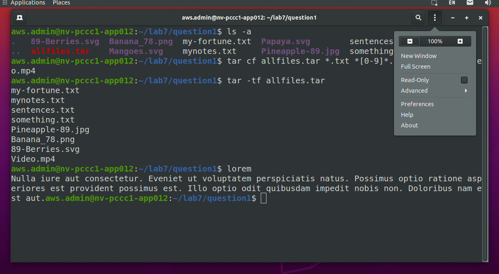
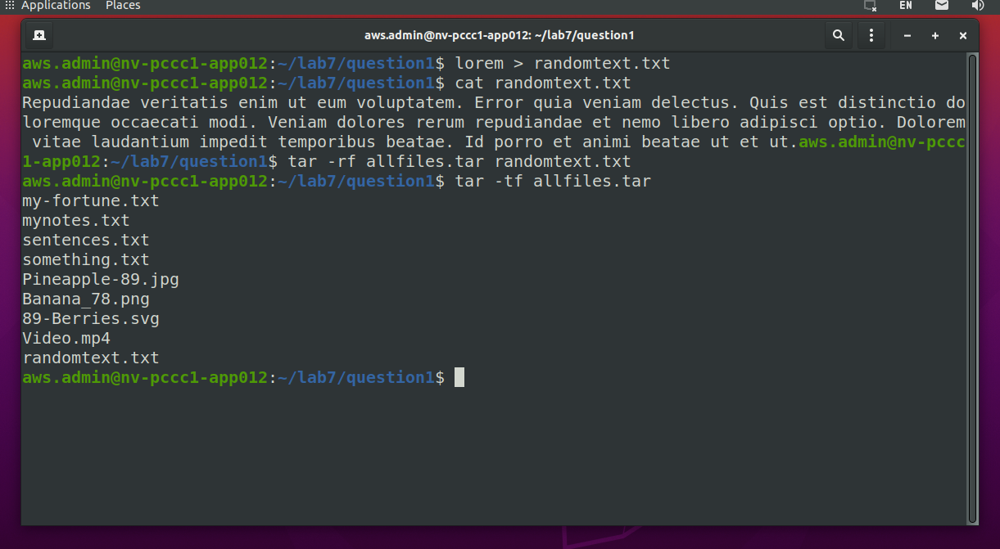
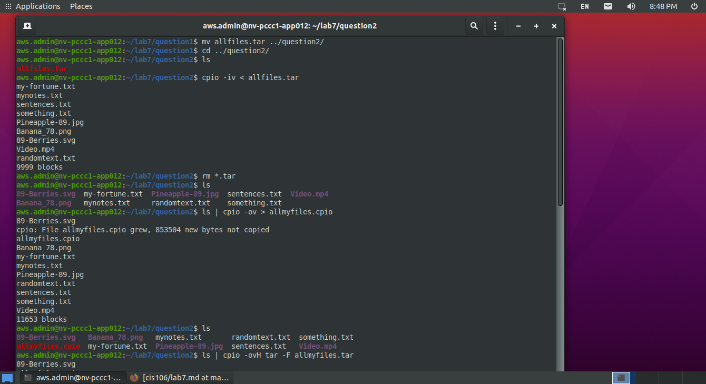
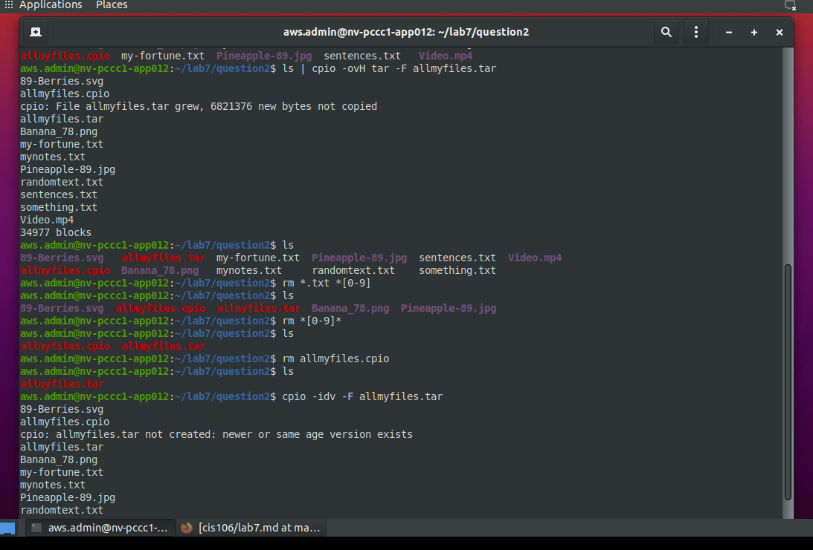
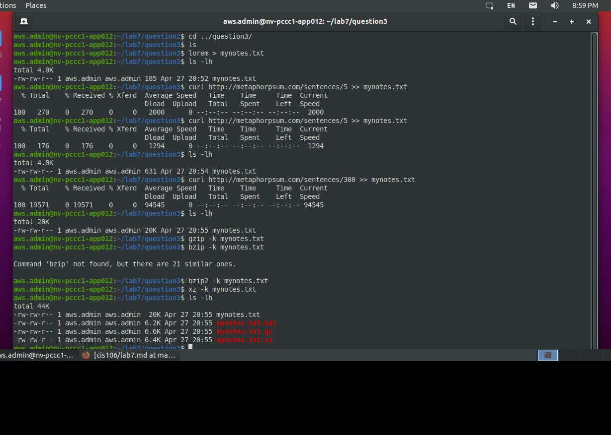
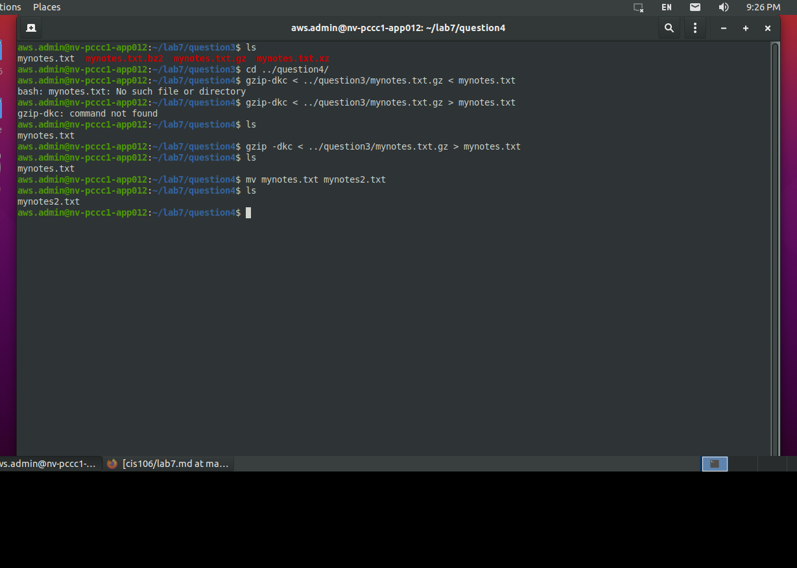
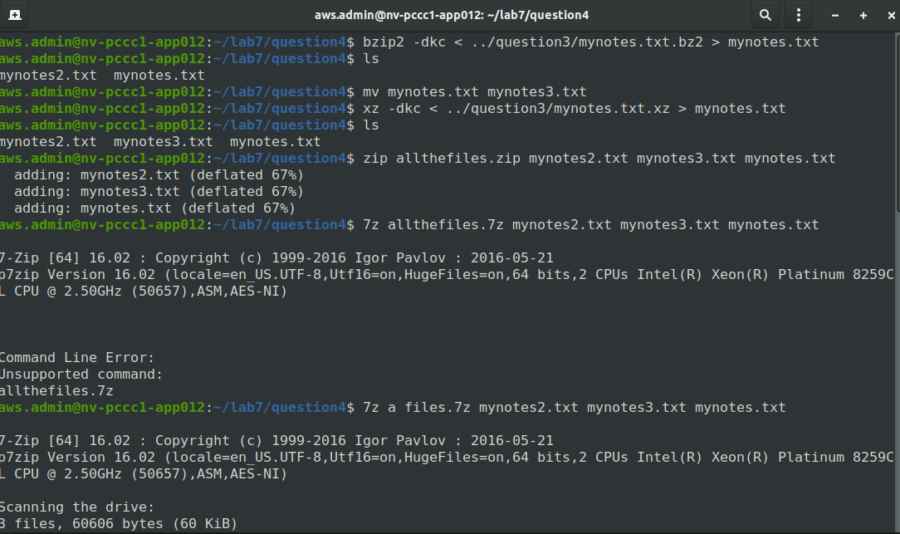
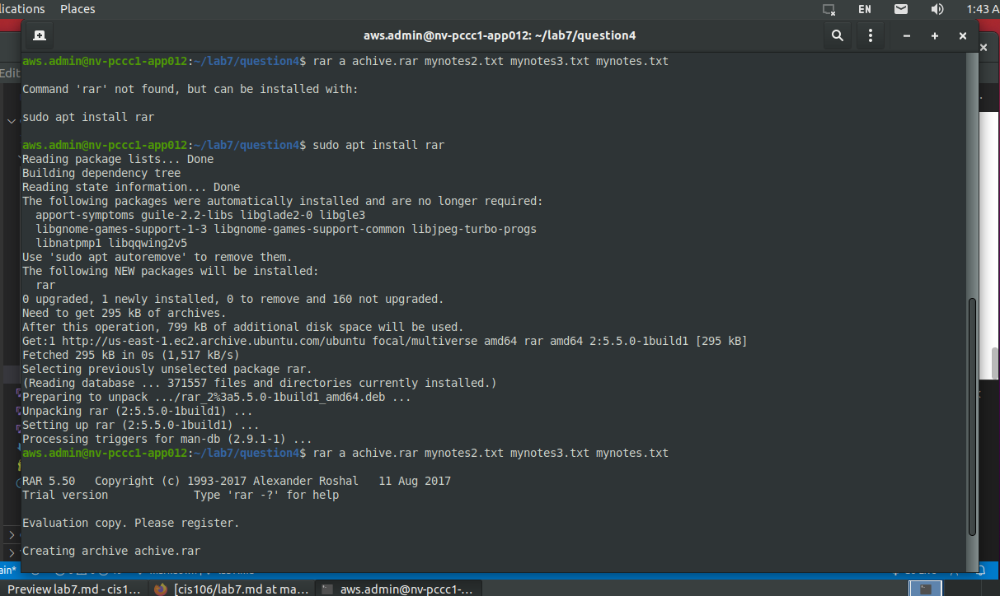

<h3> Lab 7 | Managing Data </h3> 

    For this lab, Download and run this script: https://robertalberto.com/cis106/lab7.sh
    Use: curl https://robertalberto.com/cis106/lab7.sh | bash
    For this lab we will be using the following packages:
        unrar
        p7zip-full
        libtext-lorem-perl
        zip
        ffmpeg
        The script will install all the necessary packages. * Video here

    Make sure to do all the practices in the Lecture Presentation before doing this lab.

Question 1 | Tar Utility

    In the question1 directory, you will find a bunch of files. Create an archive called allfiles.tar that includes:
        All text files
        All images that have a number in their file names
        All video files

    List all the members of the archive.

    Create another text file with some text. Use the command lorem to generate the text and then output redirection to save it to a file. If the lorem command does not work, it means that you need to install it. The package name is: libtext-lorem-perl If the package is not available use the following command and redirect its output to a file: curl http://metaphorpsum.com/sentences/5

    Add the new file to the archive.

    List all the members of the archive.

  
Question 2 | Cpio Utility

    Move the allfiles.tar archive from question 1 to the question2 directory and extract all the files.
    Remove the archive and create a new archive with cpio of all the files.
    Create a tar archive with cpio of all the files including the cpio archive.
    Remove all the files except the tar archive.
    Extract all the archive using cpio

Question 3 | Gzip, bzip2, xz

    In the question3 directory you will find 1 file called mynotes.txt. What is the size of this file?
    Compress mynotes.txt. using gzip keeping the original file.
    Compress smynotes.txt. using bzip2 keeping the original file.
    Compress smynotes.txt. using xz keeping the original file.
    Long list all the files. Which tool gave you the best compression?

    According to the picture the best compression was bu using bzip. 

Question 4 | Zip, 7zip and Rar

    Decompress all the compressed files from question 3 in the question4 directory. Make sure to rename the file after decompressing them.
    Using zip, create a zip archive of all the files.
    Create a 7zip archive of all the files.
    Create a rar archive using 7zip of all the files.
    Long list all the archives. Which one gave you the best compression ratio?

  
  
    
