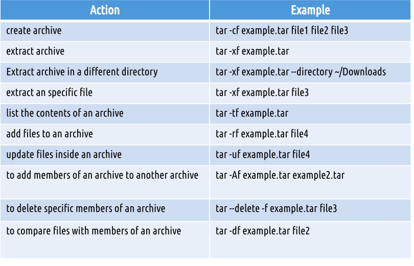

# Final Notes
## Table of Contents
- [Final Notes](#final-notes)
  - [Table of Contents](#table-of-contents)
  - [Lecture 1](#lecture-1)
  - [Lecture 2](#lecture-2)
    - [What is Virtualization?](#what-is-virtualization)
    - [Installing Ubuntu](#installing-ubuntu)
  - [Lecture 3](#lecture-3)
    - [Exploring Desktop Environments](#exploring-desktop-environments)
    - [What is shell?](#what-is-shell)
    - [Managing Software:](#managing-software)
    - [The Linux File System](#the-linux-file-system)
  - [Lecture 4](#lecture-4)
    - [Create Files/Directories](#create-filesdirectories)
    - [Getting Help!](#getting-help)
    - [Using Wildcards](#using-wildcards)
    - [Shell expansion](#shell-expansion)
  - [Lecture 5](#lecture-5)
    - [Using Nano](#using-nano)
    - [Vim](#vim)
  - [Lecture 6](#lecture-6)
    - [Managing data](#managing-data)
    - [File Permissions](#file-permissions)

## Lecture 1  

.png)
.png)

-Ubuntu is a Linux Distrubtion 

<h3>What is Debain</h3>
-Debian is an all-volunteer organization dedicated to developing free software. 

<h3>What is GUN/LINUX</h3>
-Linux is modelled on the UNIX OS

-Linux OS is a combination of The Linux Kernel and the Free Software Foundation 
-Free UNIX-like operating system was developed in 1984, called GNU 

## Lecture 2 

<h2>Notes Lecture 02|Installing Ubuntu</h2>

 ### What is Virtualization? 
-Replication of hardware to simulate a virtual machine inside a physical machine 

-There are 2 different types of virtualization ( server-side, and client-side) 

The server side provides Virtual Desktop Infrastructure 
-Meaning it servers up virtual machines. 

The client side is where software is installed on a computer to manage virtual machines
VM has its own operating system installed

<h4>Hyper visor type 1 and 2 </h4>
-Type one runs on the hardware meanwhile type two runs on a host operating system

<h4>Benefits of virtualization</h4>
-Allows running multiple operating systems on one machine 
-Reduces caused by decreasing the physical hardware that must be purchased for a network

<h4>VirtualBox</h4>
-Virtual box is a powerful type to virtualization product for enterprise as well as home use it can run on different type of OS 

<h4>Requirements</h4>
-There are certain requirements for your computer to Virtualize 
-Dual core X64 processor 
-1.3 GHz or faster 4G be a ram 
- Enough free hard drive space for installing

### Installing Ubuntu 

-To start up, open from applications and finish installing

## Lecture 3 

<h2>Notes Lecture 03 | Learning the Bash Shell</h2>

###  Exploring Desktop Environments 

- Desktop enviornments example- GNOME, MATE, CINNAMON, PANTHEON, KDE, BUDGIE,
OPENBOX, DEEPING DE, XFCE, LXDE, LXQT, FLUXBOX

 What is a DE and GUI? 
a desktop environment (DE) is an implementation of the desktop metaphor made of a bundle of
programs running on top of a computer operating system that share a common graphical user interface (GUI), sometimes described as a graphical shell.

- On windows and maOS the user is limited to a single gui and DE. however with Linux the gui choices are almost overwhelming and the flexibility is immense.

- The display manager allows you to choose between the desktop environment and the users.(display manager=login screen)
  
- System tray is a special menu, it allows users to do things like log out, lock their screen.
  
- A window manager is system software that controls the placement and appearance of windows within a windowing system in a graphical user interface.
  
The GNOME DE 
-  Official GUI for GNOME 3 is called GNOME SHELL. The desktop in Ubuntu is GNOME 3 it is used by several other Linux distributions. Like Debian, Fedora, Redhat, Oracle linux etc.

  
- XFCE DE is a lightweight DE that aims to be fast and low on system resources, while still being user friendly.
  
- The mate DE, is the continuation of GNOME 2 and has forked apps from GNOME core apps and others written from scratch. They include CAJA(box)- file manager, Pluma(pen)-text editor,Atril(lectern)- document viewer, engrampa(staple)-archive manager, Mate-terminal-terminal emulator, Marco(frame)-window manager.
  
- The Cinnamon DE is a free and open source DE for the X window system that derives from GNOME 3 but follows traditional desktop metaphor conventions. It is the principal desktop environment of the linux mint distribution.
  
- LXQt is lightweight and included in most linux and BSD distributions. It is the product of the merger between LXDE-Qt and Razor - Qt.
  
- The deepin DE is a DE of Chinese Deepin Linux distributions. It is built on Qt and is available for various distributions including Ubuntu, Arch and Fedora.
  
- The pantheon DE is the DE created for elementary O. It was written from scratch in Vala using GTK 3 and Granite. It also has some similarities with GNOME shell and macOS.

### What is shell? 

- CDL stands for a command line interface
In the Linux terminal.

- One way to get to CLI is to take the learning system out of the graphics to stop mode and place it in text mode.

- A virtual Console is a terminal session that runs in Linux system memory.
  
- You can log into the council terminal by entering your username and password after the login prompt. 

- The GNU is a program that provides interactive access to the learning system it runs as a regular program and it’s normally started whenever user logs in terminal.

- There are bash cuts that could be used for example: 
  
  

When you open a terminal the shell prompt pops up. 
  - In the shell prompt, it will include your username and the machine you are working from. 
  - Some basic commands we can run are date,uname,df amd cal.

### Managing Software:

- Package: archives that contain binaries of software, configuration files and information about dependencies. 
- Library: Reusable Code that can be used by more than one function or program. 
- Dependency: Software needed as a foundation for other software. 
- Repository: A large collection of software available. 

Debian Package Management System 
- The debian package management system is the foundation of managing all software on all Debian Distributions. 

Advanced Package Tool
- Set of tools for managing Debian packages. 
- Can do installation resuming,if you lose internet connection. 
- Updating all packages all the packages in the system. 
- Useful Commands to install,remove,update,search and more. 

Using ATP: 

- .deb files are used to install software
- In order to use deb files you need to download the the file first then can install while using dpkg / gdebi 
Example:
Sudo apt install gdebi -y 

 ###  The Linux File System 

- / = ROOT 

Commands to Move Around 
  - CD Changing Directories 
  - PWD see current path 
  - LS Displaying all the files in directory 
  
Listing Files and Directories: 
  

Paths

## Lecture 4 
<h2> Notes Lecture 04 | Manipulating files and directories</h2>

### Create Files/Directories
- You create directories using mkdir. 
- To create multiple directory separate each directory name with a space
- You can create a directory with a space in its name using the escape character or by surrounding the name in quotes 
- You can create directories using relative path or absolute path you can also create multiple directories in one command
- Touch is used to create files
- To remove files and directories use the RM command followed by the name of what you want to delete 

Moving and copying files and directories: 
- MV moves and renames directories
- Source is the file or directory that you want to move and destination is where the directory or file is going.
- The CP command copies files directories from a source to a destination

Working with links
- An inode is a data structure that contains all information about a file
- Stat ____ ( name of file/directory)

###  Getting Help! 
- Main page is our document files that describes the next social command executable program system calls special files and so forth
- To navigate the main page of a command you can use the arrow keys
- You can open specific files and sections on the main page 

### Using Wildcards
- Wild card represent letters and characteristics used to specify a file name for searches
- File globbing is the process of pattern matching 

The * star character matches any number or characters
Can be use when searching for file extensions or file names

The ? Wildcard match is precisely one character
For example you can match all the files that start with a

The [] bracket wild card matches a single character in our range 
Can be used to match specific letters or digits in a range 

### Shell expansion
- Brace expansion is not a wildcard but other feature of bash that allows you to generate strings to use with commands
- For example you can create a whole directory structure in a single command and also remove multiple files in the single directory
- You can create a number of files using touch

## Lecture 5 

<h2>Notes Lecture 05 | Command Line text editors</h2>

Linux offers a lot of command lines tools for handling tax

- The CAT command is used for displaying the content of a file
- The TAC command is used for displaying the content of a file in reverse order in a line by line basis
- We can use head or tail to display the first / last certain number of lines
- PASTE command is used to join files horizontally in columns 

Sort command is used for sorting files
- Sorting means arranging the content of a file in a particular order
- You can sort alphabetically in reverse order by number or by month
  
- The WC command is used for printing the number of lines characters and bytes in a file
- The TR command is used for translating or deleting characters from standard output
- The DIFF command compares files and display the difference between them
 
- The GREP command is used to match a string pattern from a file or a standard I’ll put when using the pipe

- The REF command is used for reversing the characters position in a given text

Nano 

- GNU nano is a text editor for Unix-like computing systems or operating environments using a command line interface.
- Nano text editor is pre-installed on Linux distros
  
### Using Nano 

- Step 1: nano ___ (file name )
- Step 2: nano +line_number,character_number filename ( to open file)
At the bottom of the window, there is a list of the most basic command shortcuts to use with the nano editor.

### Vim

- Command line text editor 
- Learning VIM takes time but crucial for system administration
- To start VIM  the text editor will start in normal mode
  
- There are different modes insert,normal,command,visual,select and EX- mode
  To save VIM file ( there are different ways)

Moving/Using Vim
- You can tell VIM that you want to add another file by just using the E command
- To navigate a file you can use Keys ( H,J,K,L)

- To move between words use W and E 
W moves word by word to the beginning of each word
E moves word by word to the end of each word
To move to a specific line use : plus the line number
$ Will move to the end of the line
01 move to the beginning of the line

- Extra Useful Commands: 

## Lecture 6 

<h2>Notes Lecture 06 | Managing Data and File permissions</h2>

### Managing data

- Backup copies files in directory turn archive
- System back up uses to restore data and a case of system failure or data loss and corruption

Archiving utilities 
- Tar creates archives by combining files in directories into a single file 
  
- TAR + Option + archivename + files to add to archive 
  

- CPIOU create a archive restores files from archive or copies or directory
  

- The AR utility did you and your AR program create modifies and extract from archives
  

Final compression

- GZIP,BZIP2,XZ compress files in a place meaning the original file is deleted after compression

  
  
  

- Zip is archiving and compression utility
- 7- zip is open source cost that form in fully featured file a clever with high compression ratio
- RAR is a archive file format , allows Linux users 
to extract of our archives

### File Permissions 

- A file can be owned only one user and one group 
- CHOWN command used to change group owner 
  
- Files can have the permissions read, execute or write 

- The first three characters show the permissions for the user who owns the file (user permissions).
- The middle three characters show the permissions for members of the file’s group (group permissions).
- The last three characters show the permissions for anyone not in the first two categories (other permissions).

There are 2 types of notations we can use to make this change. Symbolic and Number Notation 

