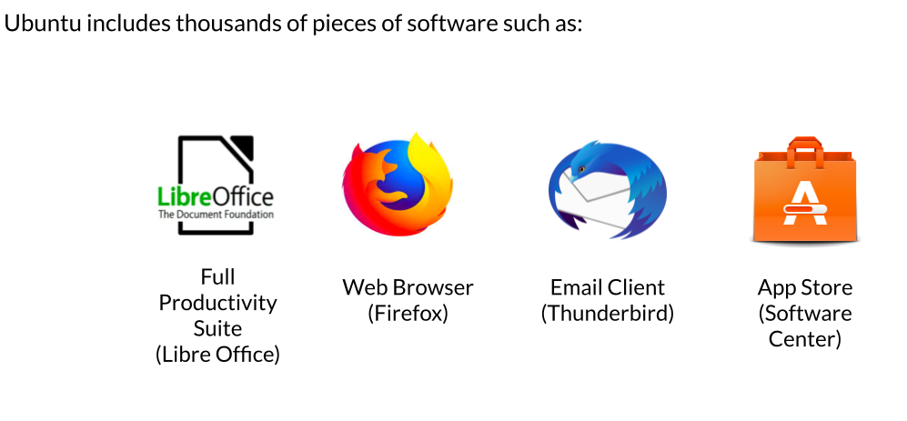

.png)
.png)

-Ubuntu is a Linux Distrubtion 

<h3>What is Debain</h3>
-Debian is an all-volunteer organization dedicated to developing free software. 

<h3>What is GUN/LINUX</h3>
-Linux is modelled on the UNIX OS

-Linux OS is a combination of The Linux Kernel and the Free Software Foundation 
-Free UNIX-like operating system was developed in 1984, called GNU 