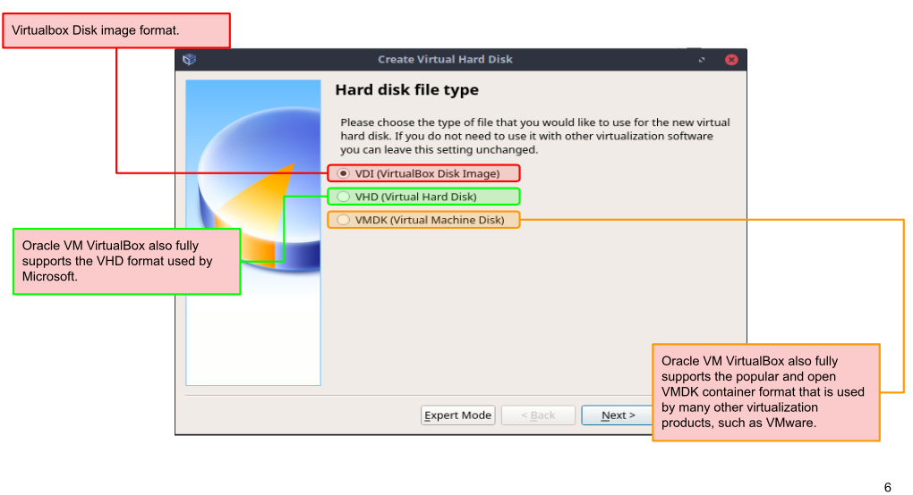
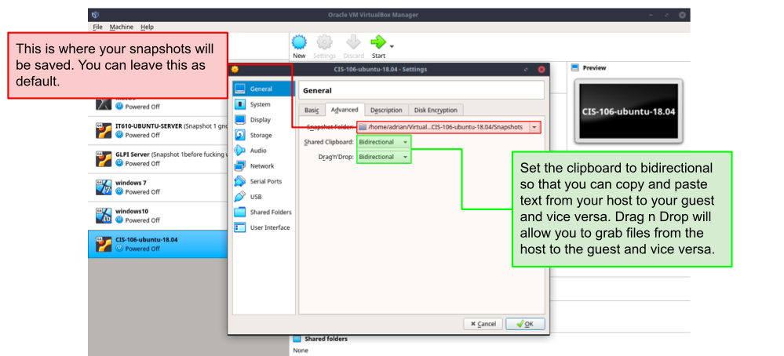
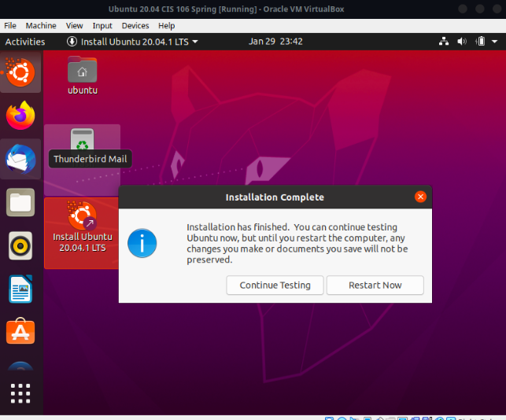

<h2>Notes Lecture 02|Installing Ubuntu</h2>

 <h3>What is Virtualization?</h3> 
-Replication of hardware to simulate a virtual machine inside a physical machine 

-There are 2 different types of virtualization ( server-side, and client-side) 

The server side provides Virtual Desktop Infrastructure 
-Meaning it servers up virtual machines. 

The client side is where software is installed on a computer to manage virtual machines
VM has its own operating system installed

<h4>Hyper visor type 1 and 2 </h4>
-Type one runs on the hardware meanwhile type two runs on a host operating system

<h4>Benefits of virtualization</h4>
-Allows running multiple operating systems on one machine 
-Reduces caused by decreasing the physical hardware that must be purchased for a network

<h4>VirtualBox</h4>
-Virtual box is a powerful type to virtualization product for enterprise as well as home use it can run on different type of OS 

<h4>Requirements</h4>
-There are certain requirements for your computer to Virtualize 
-Dual core X64 processor 
-1.3 GHz or faster 4G be a ram 
- Enough free hard drive space for installing

<h2>Installing Ubuntu </h2>

-To start up, open from applications and finish installing

