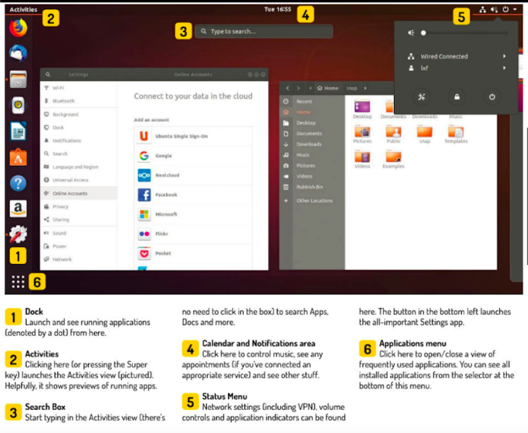
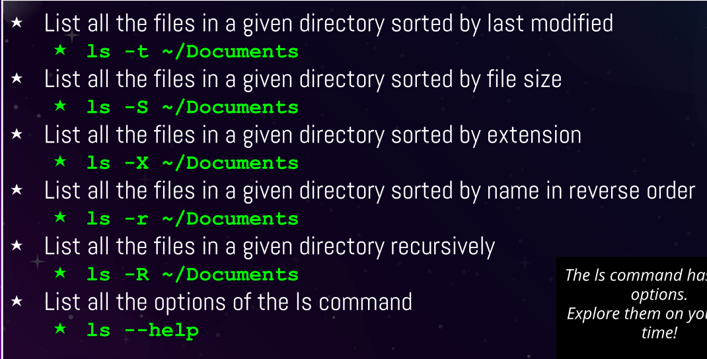

<h2>Notes Lecture 03 | Learning the Bash Shell</h2>

<h3> Exploring Desktop Environments </h3>

- Desktop enviornments example- GNOME, MATE, CINNAMON, PANTHEON, KDE, BUDGIE,
OPENBOX, DEEPING DE, XFCE, LXDE, LXQT, FLUXBOX

<h3> What is a DE and GUI? </h3>
a desktop environment (DE) is an implementation of the desktop metaphor made of a bundle of
programs running on top of a computer operating system that share a common graphical user interface (GUI), sometimes described as a graphical shell.

- On windows and maOS the user is limited to a single gui and DE. however with Linux the gui choices are almost overwhelming and the flexibility is immense.

- The display manager allows you to choose between the desktop environment and the users.(display manager=login screen)
  
- System tray is a special menu, it allows users to do things like log out, lock their screen.
  
- A window manager is system software that controls the placement and appearance of windows within a windowing system in a graphical user interface.
  
<h3>The GNOME DE </h3>
-  Official GUI for GNOME 3 is called GNOME SHELL. The desktop in Ubuntu is GNOME 3 it is used by several other Linux distributions. Like Debian, Fedora, Redhat, Oracle linux etc.

  
- XFCE DE is a lightweight DE that aims to be fast and low on system resources, while still being user friendly.
  
- The mate DE, is the continuation of GNOME 2 and has forked apps from GNOME core apps and others written from scratch. They include CAJA(box)- file manager, Pluma(pen)-text editor,Atril(lectern)- document viewer, engrampa(staple)-archive manager, Mate-terminal-terminal emulator, Marco(frame)-window manager.
  
- The Cinnamon DE is a free and open source DE for the X window system that derives from GNOME 3 but follows traditional desktop metaphor conventions. It is the principal desktop environment of the linux mint distribution.
  
- LXQt is lightweight and included in most linux and BSD distributions. It is the product of the merger between LXDE-Qt and Razor - Qt.
  
- The deepin DE is a DE of Chinese Deepin Linux distributions. It is built on Qt and is available for various distributions including Ubuntu, Arch and Fedora.
  
- The pantheon DE is the DE created for elementary O. It was written from scratch in Vala using GTK 3 and Granite. It also has some similarities with GNOME shell and macOS.

<h3> What is shell? </h3>

- CDL stands for a command line interface
In the Linux terminal.

- One way to get to CLI is to take the learning system out of the graphics to stop mode and place it in text mode.

- A virtual Console is a terminal session that runs in Linux system memory.
  
- You can log into the council terminal by entering your username and password after the login prompt. 

- The GNU is a program that provides interactive access to the learning system it runs as a regular program and it’s normally started whenever user logs in terminal.

- There are bash cuts that could be used for example: 
  
  

When you open a terminal the shell prompt pops up. 
  - In the shell prompt, it will include your username and the machine you are working from. 
  - Some basic commands we can run are date,uname,df amd cal.

<h3>Managing Software:</h3>

- Package: archives that contain binaries of software, configuration files and information about dependencies. 
- Library: Reusable Code that can be used by more than one function or program. 
- Dependency: Software needed as a foundation for other software. 
- Repository: A large collection of software available. 

Debian Package Management System 
- The debian package management system is the foundation of managing all software on all Debian Distributions. 

Advanced Package Tool
- Set of tools for managing Debian packages. 
- Can do installation resuming,if you lose internet connection. 
- Updating all packages all the packages in the system. 
- Useful Commands to install,remove,update,search and more. 

Using ATP: 

- .deb files are used to install software
- In order to use deb files you need to download the the file first then can install while using dpkg / gdebi 
Example:
Sudo apt install gdebi -y 

<h3> The Linux File System </h3>

- / = ROOT 

Commands to Move Around 
  - CD Changing Directories 
  - PWD see current path 
  - LS Displaying all the files in directory 
  
Listing Files and Directories: 
  

Paths

