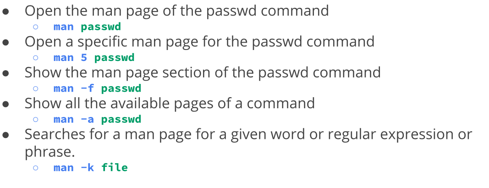

<h2> Notes Lecture 04 | Manipulating files and directories</h2>

<h3>Create Files/Directories:</h3>
- You create directories using mkdir. 
- To create multiple directory separate each directory name with a space
- You can create a directory with a space in its name using the escape character or by surrounding the name in quotes 
- You can create directories using relative path or absolute path you can also create multiple directories in one command
- Touch is used to create files
- To remove files and directories use the RM command followed by the name of what you want to delete 

Moving and copying files and directories: 
- MV moves and renames directories
- Source is the file or directory that you want to move and destination is where the directory or file is going.
- The CP command copies files directories from a source to a destination

Working with links
- An inode is a data structure that contains all information about a file
- Stat ____ ( name of file/directory)

Getting Help! 
- Main page is our document files that describes the next social command executable program system calls special files and so forth
- To navigate the main page of a command you can use the arrow keys
- You can open specific files and sections on the main page 

<h3>Using Wildcards</h3>
- Wild card represent letters and characteristics used to specify a file name for searches
- File globbing is the process of pattern matching 

The * star character matches any number or characters
Can be use when searching for file extensions or file names

The ? Wildcard match is precisely one character
For example you can match all the files that start with a

The [] bracket wild card matches a single character in our range 
Can be used to match specific letters or digits in a range 

<h3>Shell expansion</h3>
- Brace expansion is not a wildcard but other feature of bash that allows you to generate strings to use with commands
- For example you can create a whole directory structure in a single command and also remove multiple files in the single directory
- You can create a number of files using touch