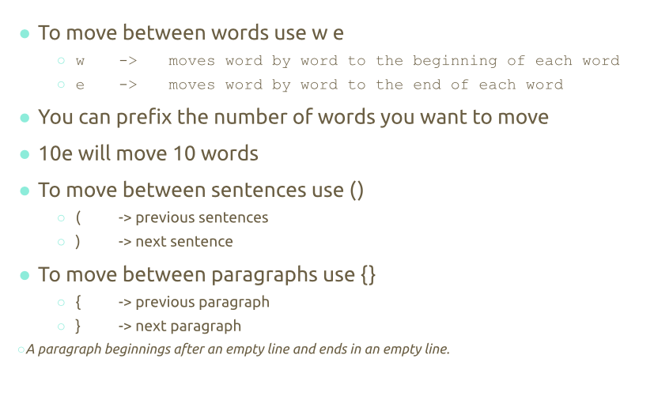

<h2>Notes Lecture 05 | Command Line text editors</h2>

Linux offers a lot of command lines tools for handling tax

- The CAT command is used for displaying the content of a file
- The TAC command is used for displaying the content of a file in reverse order in a line by line basis
- We can use head or tail to display the first / last certain number of lines
- PASTE command is used to join files horizontally in columns 

Sort command is used for sorting files
- Sorting means arranging the content of a file in a particular order
- You can sort alphabetically in reverse order by number or by month
  
- The WC command is used for printing the number of lines characters and bytes in a file
- The TR command is used for translating or deleting characters from standard output
- The DIFF command compares files and display the difference between them
 
- The GREP command is used to match a string pattern from a file or a standard I’ll put when using the pipe

- The REF command is used for reversing the characters position in a given text

<h3> Nano </h3>

- GNU nano is a text editor for Unix-like computing systems or operating environments using a command line interface.
- Nano text editor is pre-installed on Linux distros
  
Using Nano 
- Step 1: nano ___ (file name )
- Step 2: nano +line_number,character_number filename ( to open file)
At the bottom of the window, there is a list of the most basic command shortcuts to use with the nano editor.

<h3>Vim</h3>

- Command line text editor 
- Learning VIM takes time but crucial for system administration
- To start VIM  the text editor will start in normal mode
  
- There are different modes insert,normal,command,visual,select and EX- mode
  To save VIM file ( there are different ways)

Moving/Using Vim
- You can tell VIM that you want to add another file by just using the E command
- To navigate a file you can use Keys ( H,J,K,L)

- To move between words use W and E 
W moves word by word to the beginning of each word
E moves word by word to the end of each word
To move to a specific line use : plus the line number
$ Will move to the end of the line
01 move to the beginning of the line

- Extra Useful Commands: 

