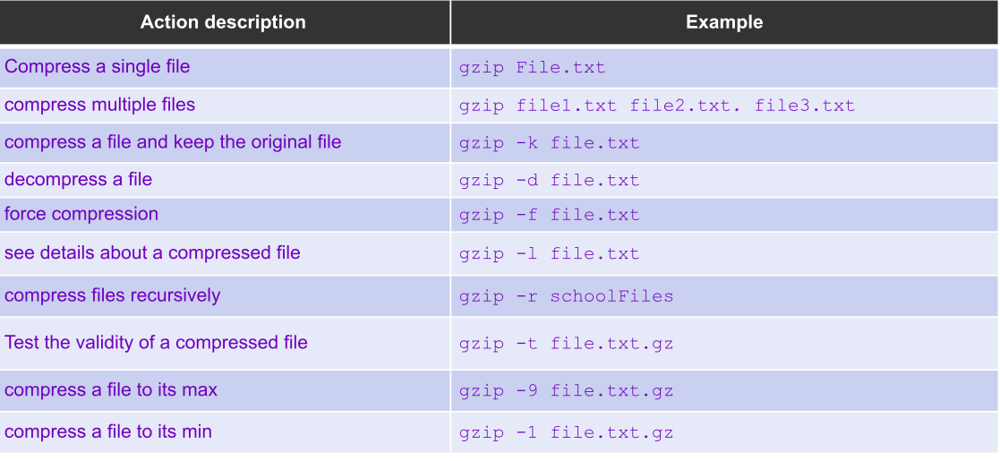
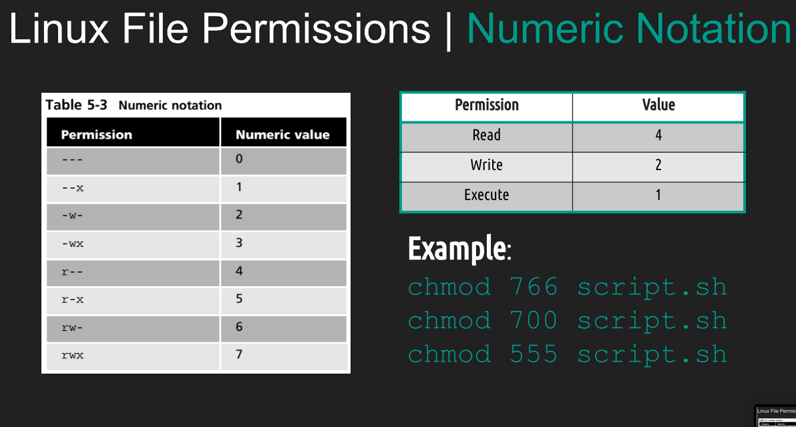

<h2>Notes Lecture 06 | Managing Data and File permissions</h2>

<h3>Managing data</h3>

- Backup copies files in directory turn archive
- System back up uses to restore data and a case of system failure or data loss and corruption

Archiving utilities 
- Tar creates archives by combining files in directories into a single file 
  
- TAR + Option + archivename + files to add to archive 
  

- CPIOU create a archive restores files from archive or copies or directory
  

- The AR utility did you and your AR program create modifies and extract from archives
  

Final compression

- GZIP,BZIP2,XZ compress files in a place meaning the original file is deleted after compression

  
  
  

- Zip is archiving and compression utility
- 7- zip is open source cost that form in fully featured file a clever with high compression ratio
- RAR is a archive file format , allows Linux users 
to extract of our archives

<h3> File Permissions </h3>

- A file can be owned only one user and one group 
- CHOWN command used to change group owner 
  
- Files can have the permissions read, execute or write 

- The first three characters show the permissions for the user who owns the file (user permissions).
- The middle three characters show the permissions for members of the file’s group (group permissions).
- The last three characters show the permissions for anyone not in the first two categories (other permissions).

There are 2 types of notations we can use to make this change. Symbolic and Number Notation 

